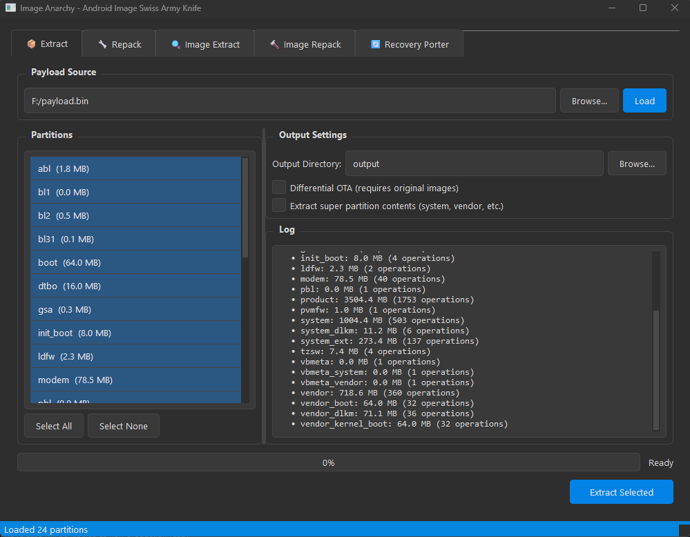
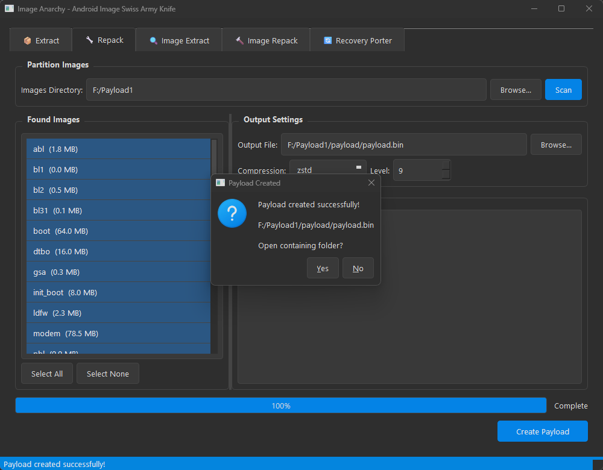
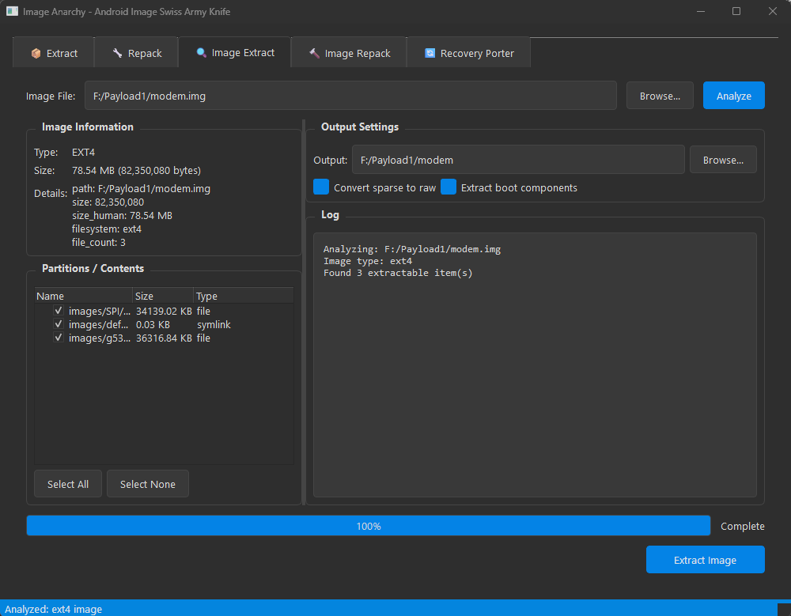
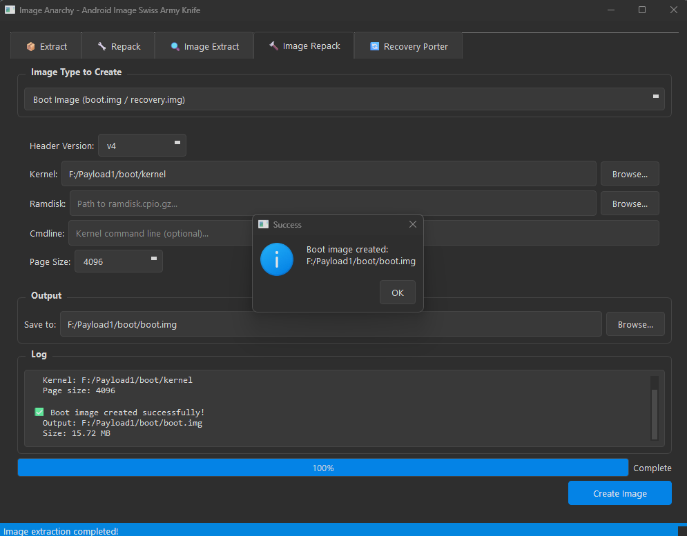
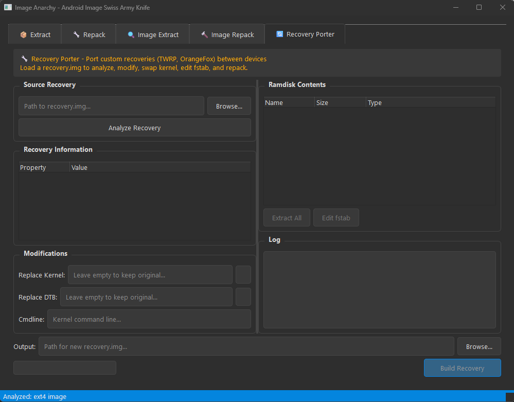
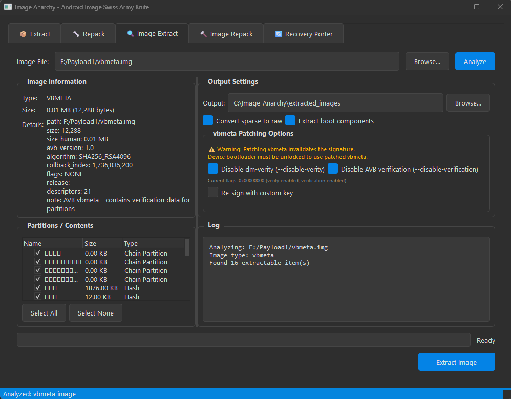

```
    ___                                  ___                        __         
   /   |  ____  ____ ___________  ___   /   |  ____  ____ _____ ___/ /_  __  __
  / /| | / __ \/ __ `/ ___/ ___/ / _ \ / /| | / __ \/ __ `/ __ `/ __ / / / / /
 / ___ |/ / / / /_/ / /  / /__  /  __// ___ |/ / / / /_/ / /_/ / /_/ / /_/ /  
/_/  |_/_/ /_/\__,_/_/   \___/  \___//_/  |_/_/ /_/\__,_/\__, /\__,_/\__, /   
                                                        /____/      /____/    
```

<p align="center">
  
  
  
  
  
</p>

<h1 align="center">Ⓐ Image Anarchy v1.0</h1>
<h3 align="center">Android Image Swiss Army Knife</h3>

<p align="center">
  <i>Break free from restrictive tools. Extract, create, and manipulate Android images with anarchic freedom.</i>
</p>

---

## 📸 Screenshots

<table>
  <tr>
    <td align="center"><b>📦 Payload Extract</b><br></td>
    <td align="center"><b>🔧 Payload Repack</b><br></td>
  </tr>
  <tr>
    <td align="center"><b>🔍 Image Extract</b><br></td>
    <td align="center"><b>🔨 Image Repack</b><br></td>
  </tr>
  <tr>
    <td align="center"><b>🔄 Recovery Porter</b><br></td>
    <td align="center"><b>📊 Vbmeta Analysis</b><br></td>
  </tr>
</table>

---

## 🔥 Features

### 📦 Payload Operations
- **Extract** partitions from `payload.bin` OTA files
- **Create** new `payload.bin` from partition images
- Support for **differential OTA** (incremental updates)
- Multiple compression: **ZSTD**, **XZ**, **BZ2**, **Brotli**
- Remote file support: HTTP, HTTPS, S3, Google Cloud Storage

### 🔍 Image Extraction
| Format | Capabilities |
|--------|-------------|
| **Sparse** | Convert to raw images |
| **Boot/Recovery/Vendor Boot** | Extract kernel, ramdisk, DTB (v0-v4) |
| **Super (Dynamic)** | Extract all logical partitions |
| **vbmeta** | Parse, patch (disable verity/verification), re-sign |
| **DTBO** | Extract device tree overlays (all entries) |
| **ABL (Android Bootloader)** | Deep analysis - Qualcomm ELF & Pixel/Tensor binary |
| **ext4** | Extract filesystem contents |
| **FAT** | Extract filesystem contents |
| **ELF/Bootloader** | Analyze XBL, TZ, firmware |

### 📱 Device Support
| Vendor | ABL Format | Features |
|--------|-----------|----------|
| **Qualcomm** | ELF | Full analysis, unlock checks, secure boot |
| **Google Pixel/Tensor** | Binary blob | Device detection, Tensor chip patterns |
| **LG** | ELF + LAF | LAF mode detection, unlock bypass research |
| **Samsung Exynos** | Binary blob | Basic detection |
| **MediaTek** | LK format | Bootloader analysis |

### 🔨 Image Repacking
- **Boot/Recovery images** (v0, v1, v2, v3, v4) - custom kernel/ramdisk
- **Vendor boot images** (v3, v4)
- **Sparse images** from raw (for faster flashing)
- **vbmeta images** with AVB disabled
- **Ramdisk** from directory (cpio + compression)

### � Recovery Porter
- **Analyze** TWRP, OrangeFox, SHRP, PitchBlack, LineageOS recovery
- **Extract** kernel, DTB, ramdisk, cmdline
- **Browse** ramdisk contents (view fstab, init scripts)
- **Swap** kernel/DTB from another device
- **Modify** cmdline and rebuild
- **Port** custom recoveries between devices
- **Educational comments** explaining recovery internals

### �🔐 Security Features
- **vbmeta patching**: Disable dm-verity and AVB verification
- **Custom AVB signing**: Re-sign with your own keys
- Key generation (RSA-2048/4096/8192)

### 🎨 User Experience
- Modern **dark-themed GUI** (PyQt6)
- **Drag & drop** support
- **Non-blocking** threaded operations
- Real-time progress and logging
- CLI mode for scripting/automation

---

## 📥 Installation

### 🎯 Portable EXE (Windows - Easiest)

Download the pre-built executable from [Releases](https://github.com/vehoelite/image-anarchy/releases):
- **No Python installation required**
- **No dependencies to install**
- Just download and run!

### Prerequisites (Python Version)
- Python 3.9 or higher
- pip (Python package manager)

### Quick Install

```bash
# Clone the repository
git clone https://github.com/vehoelite/image-anarchy.git
cd image-anarchy

# Create virtual environment (recommended)
python -m venv .venv

# Activate virtual environment
# Windows:
.venv\Scripts\activate
# Linux/macOS:
source .venv/bin/activate

# Install dependencies
pip install -r requirements.txt
```

### Dependencies

**Required:**
```bash
pip install PyQt6 bsdiff4 brotli zstandard fsspec protobuf
```

**Optional (for AVB signing):**
```bash
pip install cryptography
```

### requirements.txt
```
PyQt6>=6.4.0
bsdiff4>=1.2.0
brotli>=1.0.9
zstandard>=0.19.0
fsspec>=2023.1.0
protobuf>=4.21.0
cryptography>=40.0.0  # Optional: for AVB key signing
```

---

## 🚀 Usage

### GUI Mode (Default)

```bash
python image_anarchy.py
```

The GUI provides 5 tabs:
1. **📦 Extract** - Extract partitions from payload.bin
2. **🔧 Repack** - Create new payload.bin from images
3. **🔍 Image Extract** - Analyze and extract Android images
4. **🔨 Image Repack** - Create boot, sparse, vbmeta images
5. **🔄 Recovery Porter** - Port/modify custom recoveries

### CLI Mode

#### Extract Payload
```bash
# Extract all partitions
python image_anarchy.py --extract payload.bin

# Extract specific partitions
python image_anarchy.py --extract payload.bin -i boot,system,vendor

# Extract from OTA zip
python image_anarchy.py --extract ota_update.zip -o ./extracted/

# Extract from URL
python image_anarchy.py --extract https://example.com/payload.bin
```

#### Create Payload
```bash
# Create payload from images directory
python image_anarchy.py --create ./images/ -o new_payload.bin

# With compression
python image_anarchy.py --create ./images/ -o payload.bin --compression zstd --level 9

# With block size
python image_anarchy.py --create ./images/ -o payload.bin --block-size 262144
```

#### Process Images
```bash
# Convert sparse to raw
python image_anarchy.py --image system.img

# Extract boot image components
python image_anarchy.py --image boot.img

# Extract super partition
python image_anarchy.py --image super.img

# Analyze only (don't extract)
python image_anarchy.py --image vbmeta.img --analyze
```

---

## 📖 Examples

### Extract and Modify Boot Image

```bash
# 1. Extract boot.img from payload
python image_anarchy.py --extract payload.bin -i boot

# 2. Extract boot image components (GUI: Image Extract tab)
#    This gives you: kernel, ramdisk.cpio.gz, dtb, etc.

# 3. Modify ramdisk contents
#    Unpack: gunzip ramdisk.cpio.gz && cpio -idv < ramdisk.cpio
#    Make changes...
#    Repack using GUI: Image Repack tab -> Ramdisk

# 4. Create new boot.img (GUI: Image Repack tab -> Boot Image)
```

### Disable AVB for Custom ROM

```bash
# Using GUI:
# 1. Image Extract tab -> Load vbmeta.img
# 2. Check "Disable dm-verity" and "Disable AVB verification"  
# 3. Optionally check "Re-sign with custom key"
# 4. Extract

# Or create fresh disabled vbmeta:
# Image Repack tab -> vbmeta Image -> Check both disable options -> Create
```

### Create Sparse Image for Flashing

```bash
# GUI: Image Repack tab
# 1. Select "Sparse Image (from raw)"
# 2. Browse for your raw system.img
# 3. Set output path
# 4. Create Image

# Results in smaller file that flashes faster via fastboot
```

### Analyze ABL (Android Bootloader)

```bash
# ABL is critical for LG devices (LAF mode), unlock verification, and fastboot
# GUI: Image Extract tab
# 1. Load abl.img
# 2. Click Analyze - shows:
#    - Unlock status checks (device locked/unlocked detection)
#    - Secure boot references
#    - AVB verification calls
#    - Anti-rollback fuse reads
#    - LG-specific LAF mode (if LG device)
#    - Fastboot command handlers
# 3. Extract to get:
#    - abl_analysis_report.txt (detailed analysis)
#    - ELF segments

# Useful for:
# - Understanding how your bootloader checks unlock status
# - Finding LAF mode entry points on LG devices
# - Researching anti-rollback protection
# - Educational reverse engineering
```

### Port TWRP to Another Device

```bash
# GUI: Recovery Porter tab
# 1. Load source TWRP recovery.img (working on similar device)
# 2. Click "Analyze" to see recovery structure
# 3. Replace kernel with target device's kernel
#    - Get kernel from your device's boot.img
# 4. Replace DTB if needed (device tree for hardware)
# 5. Click "Extract All" to extract ramdisk
# 6. Edit fstab to match target device partitions:
#    - /dev/block/bootdevice/by-name/system -> your device path
#    - Update partition names and filesystem types
# 7. Set output path and click "Build Recovery"
# 8. Flash: fastboot flash recovery recovery_ported.img

# Recovery Porter detects: TWRP, OrangeFox, SHRP, PitchBlack, LineageOS
```

---

## 🏗️ Project Structure

```
image-anarchy/
├── image_anarchy.py    # Main application (single file, batteries included)
├── requirements.txt    # Python dependencies
├── README.md          # This file
├── LICENSE            # MIT License
└── .gitignore         # Git ignore rules
```

The entire application is contained in a single Python file with embedded protobuf definitions - no external proto files needed!

---

## ✅ Tested On

### OTA Payloads
- Google Pixel 6/7/8/9 (Tensor)
- Samsung Galaxy S series (Snapdragon)
- OnePlus devices
- Xiaomi/Redmi devices
- Nothing Phone
- Motorola devices

### Boot Image Versions
- v0-v2: Legacy devices
- v3: Android 11+ GKI
- v4: Android 12+ GKI (Pixel 6+)

### Recovery Images
- TWRP 3.x
- OrangeFox
- SHRP (Skyhawk)
- PitchBlack
- LineageOS Recovery

*If you test on other devices, let us know!*

---

## 📋 Changelog

### v1.0 (January 2026)
- 🎉 Initial public release
- ✅ Full payload.bin extraction and creation
- ✅ Boot image v0-v4 support (including Pixel GKI)
- ✅ Vendor boot image support
- ✅ Super partition extraction
- ✅ vbmeta parsing, patching, and custom key signing
- ✅ DTBO image extraction (device tree overlays)
- ✅ ABL analysis for Qualcomm, Pixel/Tensor, LG devices
- ✅ Recovery Porter for TWRP, OrangeFox, etc.
- ✅ ext4 and FAT filesystem extraction
- ✅ Modern PyQt6 dark-themed GUI
- ✅ Windows portable EXE

---

## 🗺️ Roadmap

### Planned for v1.x
- [ ] EROFS filesystem extraction
- [ ] F2FS filesystem support
- [ ] Device tree decompiler (DTB → DTS)
- [ ] Batch processing mode
- [ ] Drag & drop folders
- [ ] Bootloader exploit/unlocks

### Planned for v2.0
- [ ] Magisk-style boot patching (root)
- [ ] build.prop editor
- [ ] init.rc script editor
- [ ] Partition size calculator
- [ ] OTA diff viewer
- [ ] Bootloader Replacement **
- [ ] Multi-language support

### Future Ideas
- [ ] OTA generator (create OTA from two builds)
- [ ] A/B slot switcher
- [ ] Fastboot integration
- [ ] ADB sideload support
- [ ] Plugin system for custom extractors
- [ ] Recovery maker and framework
- [ ] Kernel Maker

---

## 🤝 Contributing

Contributions are welcome! Feel free to:

- 🐛 Report bugs
- 💡 Suggest features
- 🔧 Submit pull requests

---

## ⚠️ Disclaimer

This tool is provided for **educational and development/repair purposes**. 

- Modifying device images may void your warranty
- Always backup your data before flashing modified images
- Disabling AVB/dm-verity reduces device security
- Always follow your state and federal laws 
- Use at your own risk

---

## � Support

If this tool saved you time, consider supporting development:

**Bitcoin:** `bc1qx5kp5sx67qe2fd32h6ne7jvw6xpzy2xhnph0rs`

---

## �📜 License

MIT License - See [LICENSE](LICENSE) for details.

---

## 🙏 Acknowledgments

- Android Open Source Project
- Chromium OS update_engine
- The Android modding community

---

<p align="center">
  <b>Ⓐ Break the chains. Free your images. Ⓐ</b>
</p>

<p align="center">
  Made with ☕ and rebellion
</p>
